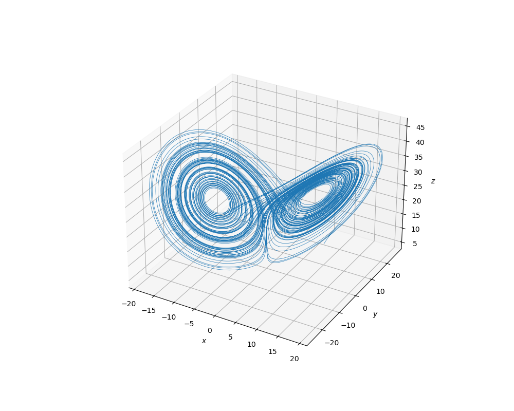

# Dynamical Systems Simulator

This project simulates a dynamical system, given by a set of 1st-order ordinary 
differential equations, with C++. It generates a .csv file with the data, 
which is analysed and plotted with Python. This project was made purely out
of interest, which was sparked from a Differential Equations and Dynamical Systems
module in my 2nd year of University as a Theoretical Physics and Applied 
Mathematics student. Below are some graphics generated from a simulation
of a Lorenz system.

Animation             |  3D Plot
:-------------------------:|:-------------------------:
 |  

## How It's Made
**Languages, Tech and Packages:**
- C++ (Visual C++ 14.50)
- Python 3.11 (Jupyter Notebook)
	- Matplotlib for graphics
		- Pyplot
		- Animation
	- Numpy for calculation
	- Pandas for handling data

**Theory:** An $n$-dimensional dynamical system can be written in the
fundamental form $\frac{d\mathbf{x}}{dt} = \mathbf{f}(\mathbf{x}; t)$,
where $\mathbf{x}$ is the $n$-dimensional vector of all the dynamical variables.
In order to simulate this, we can use the Euler method, which simply
treats $dt$ as a finite and small constant $\Delta t$ rather than infinitecimal;
thus naturally, the approximation gets better as $\Delta t \to 0^+$.
So for each of our $n$ dynamical variables $x_i$, $0 \leq i < n$, we can
approximate the change in $x_i$, $\Delta x_i$, as $\Delta x_i = f_i(x_i; t) \Delta t$
Then, the value of $x_i$ at time $t + \Delta t$ is $x_i(t+\Delta t) = x_i(t) + \Delta x_i$
This process is repeated in each timestep.

**Simulation:** All of the methodology for simulating the system is entirely
contained in the `DynamicalSystem` class. It manages the evolution 
of the system in time, from a set of initial conditions (ICs), equations
(disguised as functions) and definitions, which are passed upon instantiation.
The `DynamicalSystem::step()` function updates the state of the system according
to the Euler method described above when called.

**Output:** There is a simulation loop that stops once a time limit (set
when the dynamical system is defined) is reached. In each iteration, the
state of the system is entered as a row in a .csv file, with a column for each
variable along with time.

**Analysis and Graphics:** Pandas is used to process and analyse the .csv file,
which in turn is plotted with Matplotlib with standard methods.

## Instructions to Build/Run

This project is a Visual Studio 2026 Solution, so can be cloned directly into
VS2026. Otherwise, you can clone the repo and compile with any C++ standard, as
there are no libraries beyond C++98 used. The Jupyter Notebooks should work with
any version of Jupyter with Python3.

---

# Changelog

All notable changes to this project will be documented in this file.

The format is based on [Keep a Changelog](https://keepachangelog.com/en/1.1.0/),
and this project adheres to [Semantic Versioning](https://semver.org/spec/v2.0.0.html).

## [Unreleased]

- Other dynamical system examples such as the Rössler system, or simple cases like the pendulum or pulley
- Analysis of chaotic characteristics such as the Lyapunov exponent or bifurcation
- More generalised classes and functions for either creating systems or producing examples
- Better recording of .csv files and graphics, with names that accurately describe the system
- Better output organisation
- Automated analysis, plotting and animation with Python (hopefully without Jupyter)
- Executable for simulation with arguments for parameters

## [v0.0.0] - 2026-01-31

### Added

- DynamicalSystem Class
- Lorenz system example
- Plot and animation generation with Python
